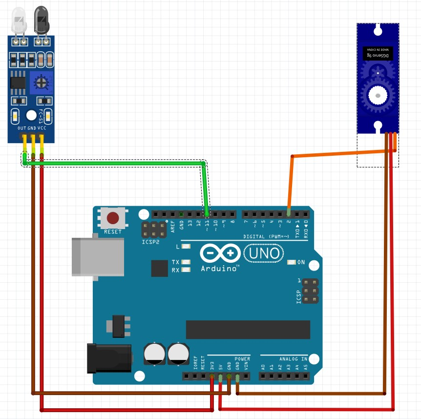

# IRLightSwitch
## "Smart" Light Switch. Basically mini servo and IR-Receiver connected to Arduino UNO, so that the light switch can be turned off with  an IR remote.

## Wiring Diagram
### Note: Other IR-Receiver used in the project but wasn't available in Fritzing (Name: AX-1838HS). Wiring stays the same.

